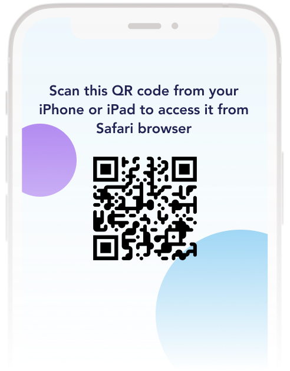
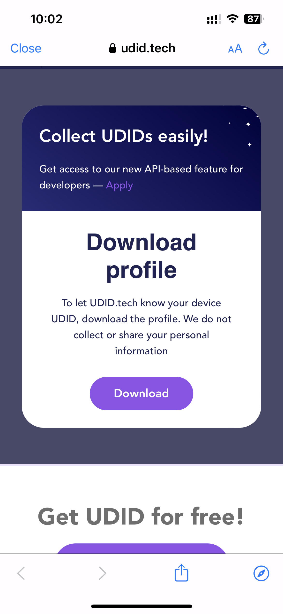
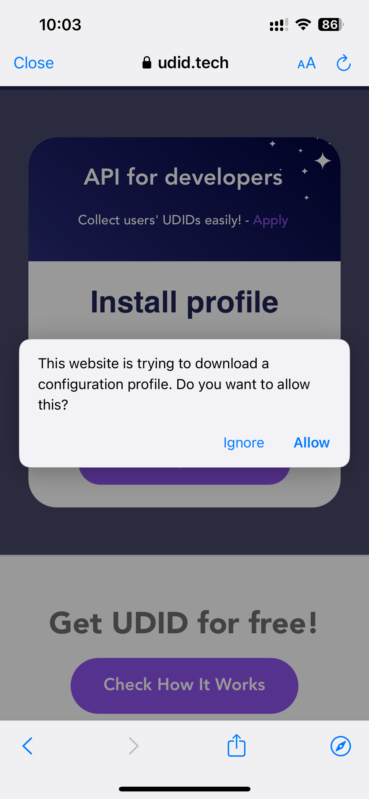
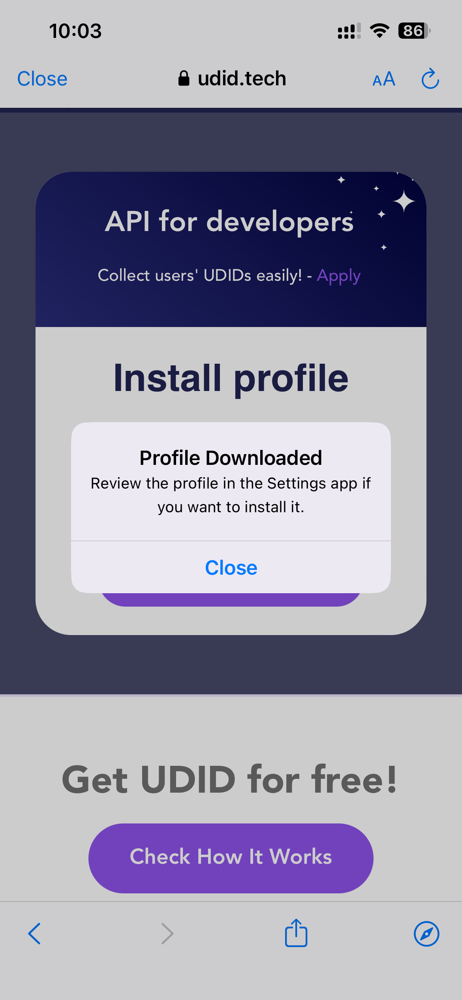
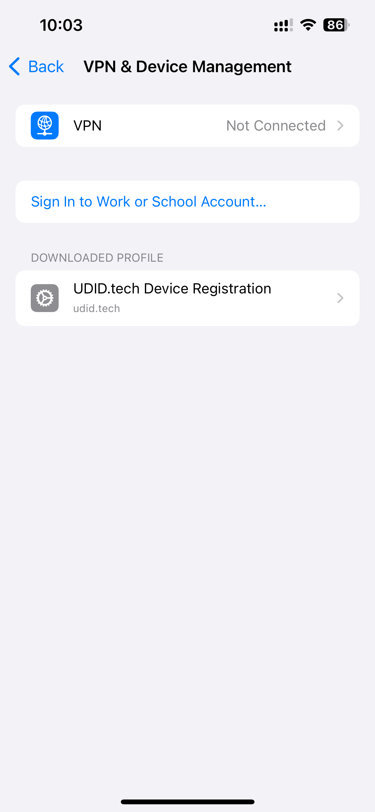
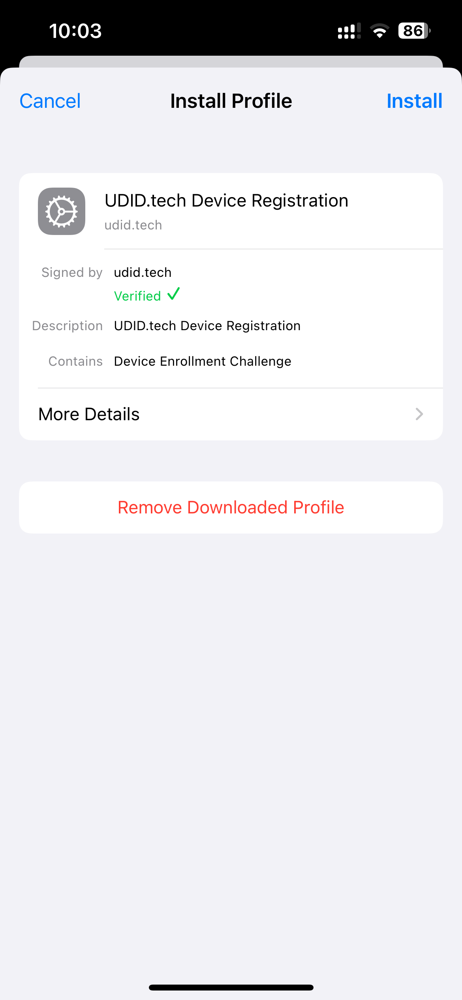
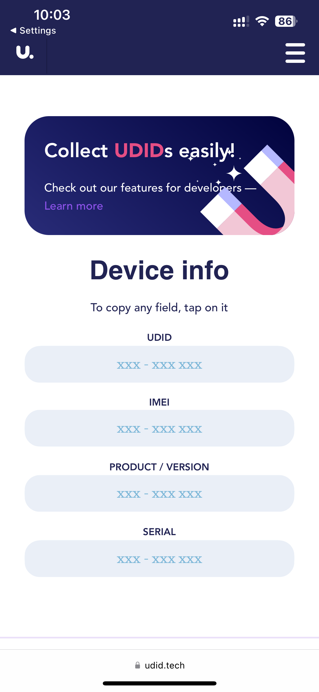

# How can I get the UDID(Unique Device Identifier) of devices without plugging in the iPhone or connecting to iTunes?

## Step 1: Download profile

You can scan this QR or open this link https://udid.tech/download-profile on your iOS device in Safari

You will see these screens and can continue to download the profile

  

## Step 2: Install profile

Go to your settings, then open **VPN & Device Management**.

_Bonus: Settings > General > VPN & Device Management_

You will see these screens and can continue to install the profile

 

👋 Well done! After successful installation, it will navigate to a site and display your UDID. You can then share it with the team.
