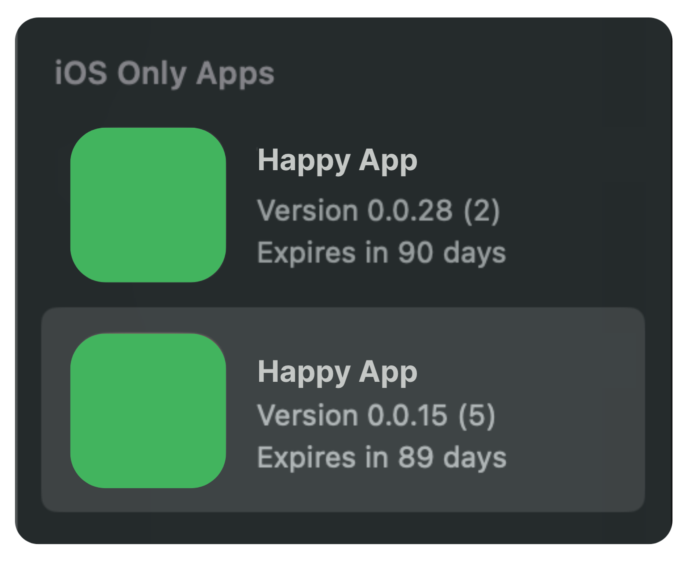

# How to Restrict Your iOS App to iPhone Only Using `UIRequiredDeviceCapabilities` and `UIDeviceFamily`

If your iOS app is designed specifically for iPhone and not intended to run on iPads, you can configure it to be installable only on iPhone devices. Apple provides two key settings to control this:

- UIRequiredDeviceCapabilities
- UIDeviceFamily

In this article, we’ll explain what they do, why they matter, and how to set them up properly in your project.

## Why Restrict to iPhone Only?

There are several valid reasons to restrict your app:

- Your UI is optimized for smaller screens.
- You rely on hardware features only available on iPhone.
- You want to avoid layout bugs or unexpected behavior on iPads.
- You don't want the app to appear on iPads in the App Store or TestFlight.

## Step 1: Understanding the Keys

**`UIRequiredDeviceCapabilities`**

This key tells the App Store what hardware or features your app requires. iPads and iPhones differ in certain capabilities. For iPhone-only restriction, the most commonly used value is:

```xml
<key>UIRequiredDeviceCapabilities</key>
<array>
    <string>telephony</string>
</array>
```

**Why?**

Only iPhones support telephony (i.e., cellular voice calls). Most iPads—even with SIM support—do not support cellular voice.

[View Apple document](https://developer.apple.com/documentation/coretelephony)

**`UIDeviceFamily`**

This key defines which device families your app supports. Its values are:

- `1` = iPhone and iPod touch
- `2` = iPad

To support **iPhone only**, use:

```xml
<key>UIDeviceFamily</key>
<array>
    <integer>1</integer>
</array>
```

This ensures your app doesn't show up in the App Store for iPad users or install on iPads.

## Step 2: How to Set This Up in Xcode

1. **Open your Xcode project**.
2. Click on your app target → **Info** tab.
3. Scroll to **Custom iOS Target Properties**.

**Add or Edit:**

- `UIDeviceFamily`: Add array with value `1` only.
- `UIRequiredDeviceCapabilities`: Add array with `telephony`.

Example in raw `Info.plist` XML:

```xml
<key>UIDeviceFamily</key>
<array>
    <integer>1</integer>
</array>

<key>UIRequiredDeviceCapabilities</key>
<array>
    <string>telephony</string>
</array>
```

_Bonus: You can also edit this directly in Info.plist file using Xcode’s property list editor or source view._

## What Happens on iPad?

- The app will not show up on the App Store when browsing from iPad.
- If someone shares a TestFlight link, the app will show “This app is not available for your device.”

- Even sideloading via .ipa or MDM won’t install it.

## Verifying It Works

1. Try opening the TestFlight link from an iPad – it should block the install.
2. Search for your app on App Store from iPad – it shouldn’t appear.
3. In TestFlight on macOS, the app may be shown under "iOS Only Apps", but marked as iPhone-only.

## Result


